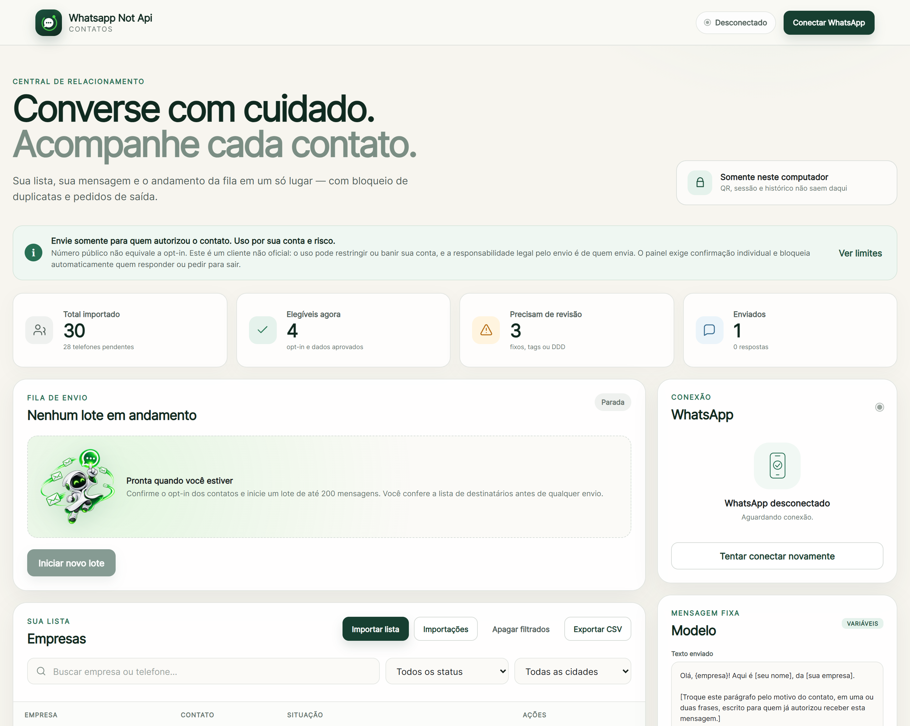
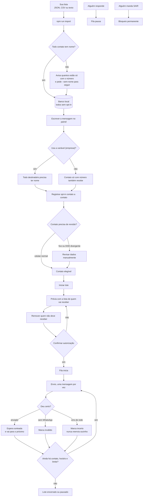
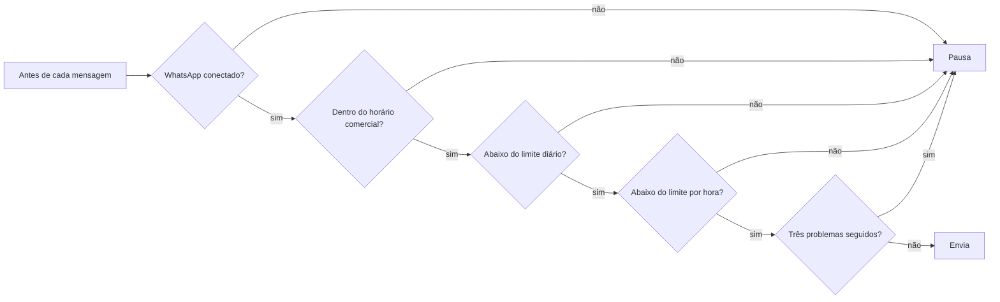
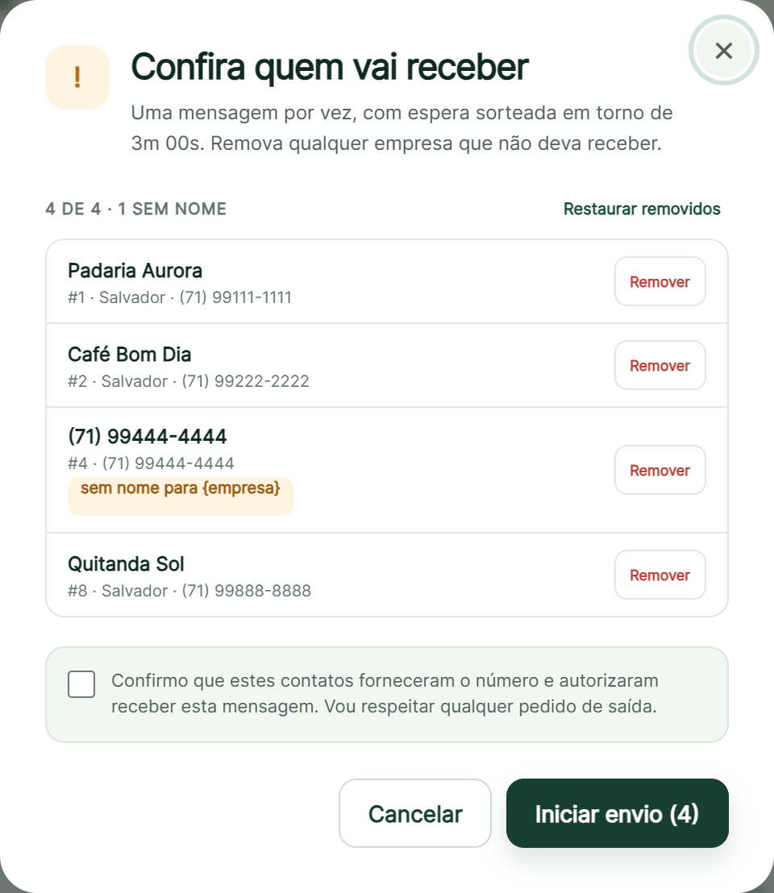
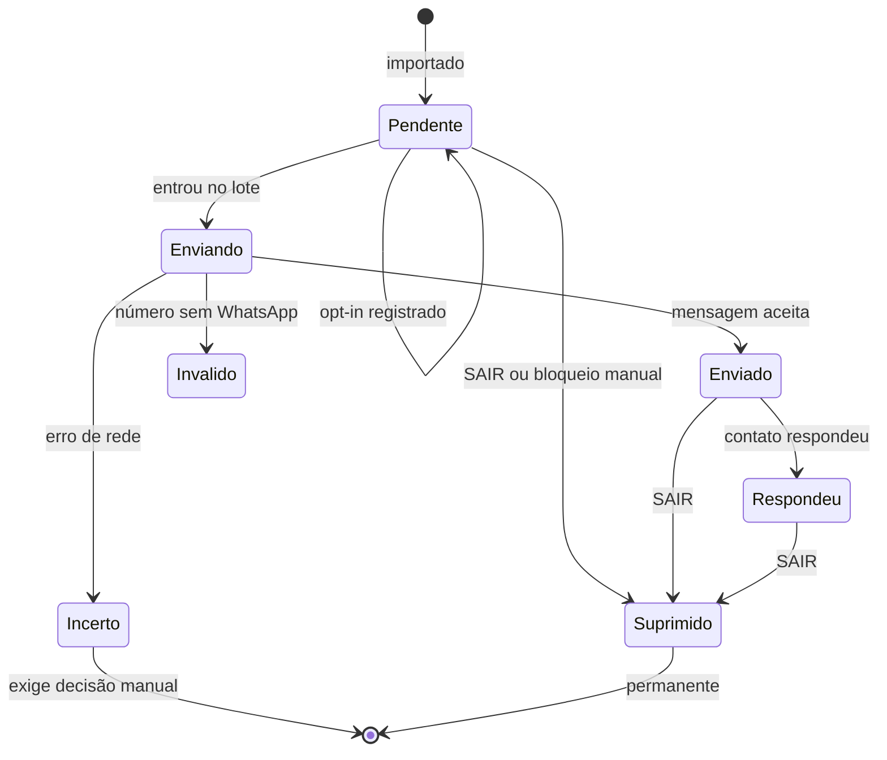
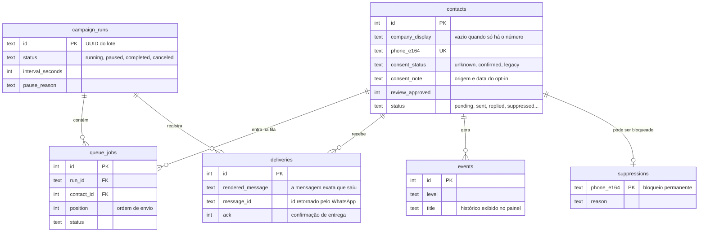

<p align="center">
  
</p>

<h1 align="center">whatsapp-not-api</h1>

<p align="center">
  <em>Painel local, open source, para falar com a sua lista pelo WhatsApp Web — uma mensagem por vez, com opt-in por contato.</em>
</p>

<p align="center">
  
  
  
  
</p>

---

Painel local para enviar uma mensagem sua, uma por vez, para uma lista de contatos sua, pelo WhatsApp Web. Roda na sua máquina, guarda tudo na sua máquina e não expõe nenhuma porta para fora de `127.0.0.1`.

O nome é literal: **não é a API oficial do WhatsApp**. É um navegador automatizado lendo o WhatsApp Web pelo QR Code.

Projeto open source sob [licença MIT](./LICENSE).

---

## ⚠️ Uso por sua conta e risco

**Leia isto antes de conectar qualquer número.**

Este software é fornecido **"COMO ESTÁ", sem garantia de nenhum tipo**, conforme a [licença MIT](./LICENSE). Ao usá-lo, você assume integralmente os riscos:

- **Sua conta de WhatsApp pode ser restringida ou banida.** Este projeto usa um cliente não oficial, o que contraria as [diretrizes do WhatsApp](https://www.whatsapp.com/legal/messaging-guidelines). Nenhum intervalo, limite ou configuração aqui elimina esse risco. Pode acontecer no primeiro envio.
- **Pode parar de funcionar sem aviso**, a qualquer mudança do WhatsApp Web.
- **A responsabilidade legal pelo envio é sua.** Quem decide para quem enviar, com qual consentimento e com qual conteúdo é você — não o software. No Brasil isso envolve a LGPD, que exige base legal para tratar dados pessoais e consentimento livre, informado e inequívoco quando é essa a base usada. Também envolve o Código de Defesa do Consumidor e a [política da Meta](https://whatsappbusiness.com/policy/).
- **Os autores e colaboradores não se responsabilizam** por banimento de conta, perda de dados, prejuízo comercial, sanção administrativa ou qualquer dano decorrente do uso, direto ou indireto.
- **Marcar a caixa de confirmação de opt-in no painel é uma declaração sua.** O software registra o que você afirma; ele não verifica nem pode verificar se o consentimento existiu de fato.

Os controles deste painel — opt-in por contato, conferência antes do lote, limites, pausa automática — reduzem **erro operacional**. Eles não transformam contato sem consentimento em uso permitido, e não substituem orientação jurídica.

Se o seu uso é comercial e recorrente, o caminho correto é a [WhatsApp Business Platform oficial](https://whatsappbusiness.com/developers/developer-hub/): API de verdade, modelos aprovados e sem risco de banimento por automação.

---

## Índice

- [⚠️ Uso por sua conta e risco](#️-uso-por-sua-conta-e-risco)
- [O painel](#o-painel)
- [O que ele faz e o que ele não faz](#o-que-ele-faz-e-o-que-ele-não-faz)
- [Instalação](#instalação)
- [O fluxo completo](#o-fluxo-completo)
- [1. Importar a lista](#1-importar-a-lista)
- [2. Escrever a mensagem](#2-escrever-a-mensagem)
- [3. Registrar o opt-in](#3-registrar-o-opt-in)
- [4. Enviar o lote](#4-enviar-o-lote)
- [Situações de um contato](#situações-de-um-contato)
- [Limites e ritmo](#limites-e-ritmo)
- [O que pode e o que não pode subir para o Git](#o-que-pode-e-o-que-não-pode-subir-para-o-git)
- [Como o painel se protege](#como-o-painel-se-protege)
- [Onde os dados ficam](#onde-os-dados-ficam)
- [O banco SQLite](#o-banco-sqlite)
- [Comandos](#comandos)
- [Estrutura do código](#estrutura-do-código)
- [Testes](#testes)
- [Antes de usar](#antes-de-usar)
- [Licença](#licença)

---

## O painel

<p align="center">
  
</p>

Tudo em uma tela: o resumo da lista, a fila, a conexão do WhatsApp e a mensagem em uso. Os prints deste README são gerados por `npm run screenshots`, sempre contra a lista fictícia de teste.

---

## O que ele faz e o que ele não faz

| Faz | Não faz |
| --- | --- |
| Importa sua lista em JSON, CSV ou texto, pelo painel ou pelo terminal | Não busca nem descobre números para você |
| Você escreve a mensagem, com variáveis do contato e personalizadas | Não escreve a mensagem por você |
| Exige opt-in registrado contato a contato | Não tem botão de "marcar todos como autorizados" |
| Mostra a lista de destinatários antes de enviar, com remoção individual | Não dispara nada sem essa conferência |
| Envia uma mensagem por vez, com espera sorteada | Não envia em paralelo nem em rajada |
| Para sozinho diante de resposta, desconexão ou erro | Não retoma sozinho depois de parar |
| Bloqueia permanentemente quem pedir `SAIR` | Não permite desfazer esse bloqueio pelo painel |
| Edita nome, telefone e cidade, e apaga contatos | Não apaga o bloqueio de quem pediu `SAIR` |
| Etiqueta, filtra, exporta o filtro e desfaz importações | Não decide sozinho o desfecho de um envio incerto |

---

## Instalação

Requer **Node.js 24 ou superior**.

```powershell
npm run setup:windows
npm start
```

No Windows dá para usar [iniciar.bat](./iniciar.bat), que faz as duas coisas.

Depois abra `http://127.0.0.1:3333`. O servidor aceita conexão só deste computador — não adianta tentar acessar de outro aparelho da rede.

Na primeira abertura o painel mostra um QR Code. Leia em **WhatsApp → Aparelhos conectados → Conectar aparelho**.

---

## O fluxo completo



### Onde a fila para sozinha



Nenhuma dessas pausas se desfaz sozinha. Você retoma no painel, de propósito.

---

## 1. Importar a lista

### Pelo painel (sem terminal)

Botão **Importar lista** no cabeçalho da lista. Escolha um arquivo `.json`, `.csv` ou `.txt` — ou simplesmente cole
o conteúdo no campo de texto.

O painel **analisa primeiro e não grava nada**: mostra o formato reconhecido, quantos contatos têm telefone válido,
quantos vieram só com o número, quantos precisarão de revisão, uma amostra das primeiras linhas e a lista de avisos.
Só depois de você confirmar é que a importação acontece.

Se houver contato sem nome, ele pede uma confirmação explícita antes de seguir — sem nome, a mensagem não pode usar
a variável `{empresa}` para aquele contato.

### Pelo terminal

```powershell
npm run import -- "C:\caminho\lista.txt"            # simula e mostra o que faria
npm run import -- "C:\caminho\lista.txt" --aplicar  # grava
```

O formato é detectado sozinho nos dois caminhos. Nada é gravado sem `--aplicar`.

### Texto (um por linha)

O nome da empresa vai na frente do número. Traço, vírgula, ponto e vírgula, dois pontos, barra vertical ou só espaço — todos funcionam como separador:

```text
Padaria Aurora — (71) 99111-xxxx
2. Café Bom Dia - 71 99222-xxxx
Mercado Central, 71993333xxx
Loja 2 | 719944xxxx
Doceria Lua: +55 71 99555-xxxx
```

### Só os números

Também funciona, sem nome nenhum:

```text
71991111xxxx
+5571992222xxx
(71) 99333-xxxx
```

Quando a lista tem contato sem nome, o comando **para e avisa**:

```text
1 contato(s) vieram só com o número.
Coloque o nome da empresa antes do número (ex.: "Padaria Aurora — 71991111111"),
ou repita o comando com --sem-nome para seguir apenas com os números.
Sem nome, a mensagem não pode usar a variável {empresa}.
```

Você escolhe: volta e põe os nomes, ou segue com `--sem-nome`.

```powershell
npm run import -- "C:\caminho\numeros.txt" --sem-nome --aplicar
```

### CSV

Cabeçalho em qualquer ordem, separado por `,`, `;` ou TAB. Só `telefone` é obrigatório:

```csv
empresa,telefone,cidade
Padaria Aurora,(71) 99111-xxxx,Salvador
,7199222xxxx,
```

Nomes de coluna aceitos, com ou sem acento e em qualquer caixa:

| Campo | Aceita |
| --- | --- |
| telefone | `telefone`, `numero`, `phone`, `celular`, `whatsapp`, `fone`, `contato` |
| nome | `empresa`, `nome`, `name`, `company`, `cliente`, `razao social` |
| cidade | `cidade`, `city`, `municipio` |

### JSON

Lista de objetos, lista de números, ou objeto com a chave `contacts`:

```json
[
  { "empresa": "Padaria Aurora", "telefone": "(71) 99111-xxxx", "cidade": "Salvador" },
  { "nome": "Café Bom Dia", "numero": "7199222xxxx" },
  { "phone": "7199333xxxx" }
]
```

```json
["7199111xxxx1", "+557199222xxx2"]
```

### O que a importação faz com cada linha

- telefone repetido é descartado com aviso, não vira contato duplicado;
- telefone que não é um número brasileiro válido entra marcado como **inválido** e nunca é enviado;
- telefone fixo e DDD que não bate com a cidade entram pedindo **revisão manual**;
- reimportar o mesmo arquivo não duplica nada e **não apaga opt-in já registrado**;
- todo contato importado entra **sem opt-in**. Importar não autoriza ninguém.

Use `--cidade "Salvador"` para preencher a cidade de todas as linhas que vieram sem ela.

---

## 2. Escrever a mensagem

No painel, campo **Mensagem**. Máximo de 4096 caracteres.

### Variáveis

Abaixo do texto há a barra de **Variáveis**. Clique em uma para inserir onde o cursor estiver.

**Do contato** — mudam a cada destinatário, vindas da linha importada:

| Variável | Vem de |
| --- | --- |
| `{empresa}` | Nome da empresa |
| `{cidade}` | Cidade do contato |
| `{telefone}` | Telefone do contato |

**Personalizadas** — valor fixo, igual para todo mundo. Use **Gerenciar** para adicionar e remover: seu nome, o nome
da sua empresa, um link, o que fizer sentido. O nome é normalizado (vira minúsculo, sem acento e sem espaço), não
pode repetir uma variável do contato, e o valor não pode conter `{` ou `}`.

Duas travas que evitam mensagem quebrada:

- **Remover uma variável que a mensagem usa é recusado.** Ajuste o texto antes — senão o modelo salvo ficaria
  inválido sem ninguém perceber.
- **Variável do contato que falta em alguém barra o lote**, dizendo qual variável e em quantos contatos. Se a
  mensagem usa `{cidade}` e três destinatários não têm cidade, o lote não sai: preencha o dado ou tire a variável.

Toda variável é opcional. Uma mensagem sem nenhuma vai igual para todo mundo, e contatos importados só com o número
funcionam normalmente.

O painel mostra a prévia com um nome de exemplo enquanto você escreve. É preciso salvar antes de iniciar um lote.

---

## 3. Registrar o opt-in

Nenhum contato entra na fila sem isso. São dois caminhos.

### Um a um, no painel

Botão **Registrar opt-in** na linha do contato. A confirmação é uma declaração explícita de que aquela empresa forneceu o número e aceitou receber a mensagem, com um campo livre para anotar como e quando.

### Em lote, a partir de um arquivo de comprovação

Quando o consentimento já existe fora do painel (formulário, cadastro de cliente, conversa anterior):

```powershell
npm run import-consent -- "C:\caminho\opt-ins.csv"            # simula
npm run import-consent -- "C:\caminho\opt-ins.csv" --aplicar  # grava
```

```csv
telefone,data,origem,observacao
(71) 99111-xxxx,28/08/2026,formulário do site,pediu demonstração
7199222xxxx,15/07/2026,cadastro de cliente,
```

`telefone`, `data` e `origem` são obrigatórios em toda linha. A origem e a data ficam gravadas junto do opt-in — é isso que torna o registro verificável depois. Linha sem esses dados é descartada com aviso; telefone fora da base é apenas relatado; contato já enviado, suprimido ou que respondeu não recebe opt-in retroativo.

> Não existe "marcar todos como autorizados". O registro precisa vir de um consentimento que aconteceu.

---

## 4. Enviar o lote

**Iniciar novo lote** abre duas etapas.

**Etapa 1** — quantidade (até 200) e intervalo entre mensagens.

**Etapa 2** — a prévia:

<p align="center">
  
</p>

A lista completa de quem receberia, com nome, cidade, telefone e a mensagem já montada (passe o mouse na linha). Cada linha tem **Remover**; o contador acompanha, e **Restaurar removidos** desfaz. Linhas sem nome aparecem marcadas quando a mensagem usa `{empresa}`.

Só depois de marcar a confirmação de autorização o lote começa.

Se algum contato da lista que você conferiu deixar de estar elegível entre a conferência e o "Iniciar" — porque respondeu, foi bloqueado ou perdeu o opt-in — **o lote inteiro é recusado**, em vez de sair diferente do que você aprovou.

Durante o envio: **Pausar**, **Retomar** e **Cancelar lote**. Itens ainda pendentes de um lote cancelado voltam para a lista.

### Limpar o lote do painel

Um lote encerrado continua visível com os contadores. Para voltar ao estado inicial, use **Limpar lote** — ou deixe
marcada a opção de limpar dentro do próprio modal de cancelamento.

Limpar remove o lote e seus itens de fila. **O que já foi enviado continua enviado**: o status de cada contato e o
histórico com a mensagem exata que saiu não são tocados. Um lote ainda rodando não pode ser limpo — pause ou cancele
antes.

---

## Editar e apagar contatos

Cada linha da tabela tem **Gerenciar**, que abre tudo o que dá para fazer com aquele contato.

### Corrigir dados

Nome, telefone e cidade são editáveis. Corrigir o telefone é o caminho para resolver os contatos marcados como *Revisar* ou *Sem telefone*:

- o número é revalidado e o contato é reclassificado (celular ou fixo, DDD conferido contra a cidade);
- a **aprovação de revisão cai automaticamente** — o dado mudou, então a conferência anterior não vale mais para o número novo;
- um contato que estava como *Sem telefone* volta para *Pendente* ao ganhar um número válido;
- número inválido é recusado, e número já usado por outro contato também.

### Desfazer

| Ação | O que faz |
| --- | --- |
| **Revogar opt-in** | Volta o contato para *Sem opt-in* e o tira da fila. Serve para quando a confirmação foi registrada por engano |
| **Desfazer revisão** | Devolve o contato para conferência de dados |
| **Bloquear para sempre** | Supressão permanente. O painel não desfaz |

### Etiquetas

Campo **Etiquetas** no mesmo modal, separadas por vírgula. Servem para segmentar a lista além de cidade e status — `clientes`, `evento`, `retorno`, o que fizer sentido.

São normalizadas em minúsculas, então `Clientes` e `clientes` são a mesma etiqueta. O filtro de etiqueta fica na barra da lista, ao lado de status e cidade, e vale também para exportar e para apagar em massa.

### Histórico de envio

O modal mostra o que já saiu para aquele contato: a data, o desfecho e **a mensagem exata que foi enviada**. Se você mudou o modelo depois, o histórico continua mostrando o texto que a pessoa recebeu — não o texto atual.

### Resolver um envio incerto

Contato com **Resultado incerto** ganha uma caixa própria no modal. O painel não decide isso sozinho: você confere no WhatsApp e diz o que aconteceu.

| Escolha | Efeito |
| --- | --- |
| **A mensagem chegou** | Vira *Enviado*, com a data preenchida |
| **Não chegou, voltar para a fila** | Vira *Pendente* e pode ser enviado de novo |

### Apagar

O botão **Apagar** remove o contato de vez. O modal diz antes o que vai junto: o histórico de envio daquele contato.

Para apagar em massa, use **Apagar filtrados** no cabeçalho da lista. Ele apaga exatamente o conjunto que a tabela está mostrando — filtro, cidade e busca combinados — e pede que você digite `APAGAR` para confirmar. É assim que se desfaz uma importação errada: filtre, confira o número e apague.

### Desfazer uma importação inteira

O botão **Importações**, no cabeçalho da lista, mostra cada importação já feita — arquivo, formato, quantos entraram e quantos ainda estão na lista — com **Desfazer** ao lado.

Desfazer apaga só os contatos daquele lote que ainda existem. A lista inicial e as outras importações não são tocadas. É o caminho limpo para quando o arquivo errado entrou.

> Só importações feitas a partir desta versão aparecem aqui. Contatos que já estavam na base antes não pertencem a lote nenhum, e por isso não podem ser desfeitos em bloco — para esses, use **Apagar filtrados**.

### Exportar o que está na tela

**Exportar CSV** vira **Exportar filtrados** assim que você aplica qualquer filtro, e passa a exportar exatamente o conjunto visível. O CSV inclui o `consent_note`, ou seja, a origem e a data do opt-in de cada contato.

Três garantias que valem conhecer:

- **Quem pediu `SAIR` continua bloqueado.** A supressão é gravada por telefone, não por contato: ela sobrevive a apagar o contato e a reimportar o mesmo número depois. Não existe caminho para "limpar" um bloqueio apagando a linha.
- **Contato em lote ativo não é apagado nem editado.** Conclua ou cancele o lote antes.
- **A exclusão em massa confere a contagem.** O painel manda junto o total que exibiu; se o banco discordar, a operação é recusada em vez de apagar um conjunto diferente do que você viu.

---

## Situações de um contato



| Situação | O que significa |
| --- | --- |
| **Pendente** | Ainda não recebeu nada |
| **Sem opt-in** | Falta a autorização; não entra em lote |
| **Revisar** | Fixo, DDD divergente ou marcado na origem; precisa de conferência |
| **Sem nome** | Importado só com o número; `{empresa}` não funciona para ele |
| **Enviado** | Mensagem entregue ao WhatsApp |
| **Respondeu** | Respondeu; novos envios automáticos ficam bloqueados |
| **Resultado incerto** | Caiu no meio do envio; **nunca é reenviado sozinho** |
| **Sem telefone** | Número inválido ou ausente |
| **Não contatar** | Supressão permanente, não desfeita pelo painel |

---

## Limites e ritmo

Tudo em [src/config.js](./src/config.js):

| Ajuste | Padrão | O que faz |
| --- | --- | --- |
| `minIntervalSeconds` | 90 | Piso absoluto entre duas mensagens |
| `defaultIntervalSeconds` | 180 | Intervalo sugerido no painel |
| `intervalJitterRatio` | 0.35 | Sorteia cada espera em ±35% do intervalo |
| `maxBatchSize` | 200 | Contatos por lote |
| `hourlyLimit` | 40 | Teto por hora |
| `dailyLimit` | 500 | Teto por dia |
| `businessHourStart` / `End` | 9 / 18 | Janela de envio, no relógio do computador |

**Os tetos não se somam, e o tamanho do lote não acelera nada.** Um lote de 200 não envia mais rápido que um de 20: ele só evita que você precise iniciar um lote novo a cada meia hora. O que realmente limita o volume é o intervalo mínimo — a 90 segundos por mensagem cabem no máximo 40 envios por hora e, na janela de 09h às 18h, cerca de **360 por dia**.

Na prática, com os padrões atuais:

| | |
| --- | --- |
| Um lote de 200 leva | **5 horas ou mais** (200 ÷ 40 por hora) |
| Cabem por dia na janela 09h–18h | ~360 mensagens |
| `dailyLimit: 500` | trava final, não é alcançável sem baixar o intervalo |

Um lote de 200 iniciado às 14h não termina no mesmo dia: ele pausa às 18h com "fim do horário comercial" e espera você retomar. Isso é esperado — a fila nunca retoma sozinha.

Para chegar perto de 500/dia seria preciso baixar `minIntervalSeconds`, e é aí que o risco de bloqueio da conta cresce de verdade.

A espera entre mensagens é sorteada dentro da faixa, então o intervalo de 3 minutos vira algo entre ~2min e ~4min a cada envio. O piso de 90 s nunca é ultrapassado para baixo.

---

## O que pode e o que não pode subir para o Git

Isto importa: o repositório é código, não os seus contatos.

### Pode subir

| Caminho | Por quê |
| --- | --- |
| `src/`, `public/`, `scripts/`, `test/` | É o código |
| `package.json`, `package-lock.json` | Dependências |
| `README.md`, `.gitignore`, `.env.example` | Documentação e modelos |
| `iniciar.bat` | Atalho de execução |
| `test/fixtures/contacts.json` | Lista fictícia, feita só para os testes |
| `public/img/`, `public/olhaozapai.png` | Mascote e assinatura do rodapé |
| `docs/*.png` | Prints gerados a partir da lista fictícia |
| `LICENSE` | Licença MIT |

### Não pode subir

| Caminho | Por quê |
| --- | --- |
| `.wwebjs_auth/`, `.wwebjs_cache/` | **É a credencial da sua conta.** Quem tiver essa pasta entra no seu WhatsApp sem QR Code |
| `data/*.json`, `data/*.csv`, `data/*.txt` | Sua lista de contatos: dado pessoal de terceiros |
| `data/*.db`, `data/*.db-*` | Banco com contatos, opt-ins e histórico de envio |
| `opt-ins*.csv`, `contatos*.csv` | Comprovações de consentimento |
| `.env` | Caminhos e configuração da sua máquina |
| `*.log` | Pode conter telefone |

O [.gitignore](./.gitignore) já cobre todos esses. **Confira antes do primeiro push:**

```powershell
git status --short
git check-ignore -v data/seed-contacts.json .wwebjs_auth
```

Se algum arquivo de dado aparecer em `git status`, ele ainda não está ignorado — não faça o commit antes de resolver.

> Confira também **onde fica a raiz do repositório**, com `git rev-parse --show-toplevel`. Se ela apontar para a sua pasta pessoal em vez da pasta do projeto, um `git push` pode publicar muito mais do que este projeto. Nesse caso, crie um repositório só para ele:
>
> ```powershell
> cd caminho\do\whatsapp-not-api
> git init
> git add .
> git status --short   # confira a lista antes de commitar
> ```

Se você já commitou um desses por engano, **trocar o arquivo por outro no commit seguinte não resolve**: o conteúdo continua no histórico. Nesse caso, desconecte a sessão do WhatsApp pelo painel (invalida a credencial vazada) e reescreva o histórico antes de publicar o repositório.

---

## Como o painel se protege

Não há login: o que isola os dados é a fronteira de rede. Três camadas, todas com teste de regressão em
[test/security.test.js](./test/security.test.js).

| Camada | O que faz |
| --- | --- |
| **Bind fixo** | O servidor escuta só em `127.0.0.1`. É literal no código, não lê variável de ambiente — não dá para expor na rede por engano |
| **Validação de Host** | Requisição cujo `Host` não seja `127.0.0.1`, `localhost` ou `[::1]` recebe **403**, em *qualquer* método. É o que barra DNS rebinding: sem isso, uma página externa conseguiria ler sua lista inteira |
| **Checagem de origem** | Escrita exige prova de mesma origem e **falha fechada** — sem essa prova, nega. Clientes fora do navegador se identificam com o cabeçalho `X-Local-Client` |

Além disso: CSP sem `unsafe-inline`, todo dado do usuário escapado antes de ir ao DOM, valores de SQL sempre por
*placeholder*, fórmulas neutralizadas no CSV exportado (inclusive com TAB ou CR à frente) e teto de conexões de
tempo real.

### O que isso não cobre

- **Quem tem acesso à máquina tem acesso a tudo.** Não há autenticação nem registro por autor: qualquer processo
  local que fale HTTP com a porta pode ler, editar, apagar e disparar mensagens.
- **O banco não é cifrado em repouso.** Ele guarda telefone, nome, a nota de consentimento e o texto exato enviado.
  A proteção é a permissão do sistema de arquivos.
- **Não coloque o painel atrás de proxy reverso** nem exponha a porta. As três camadas acima assumem que só a sua
  máquina alcança o serviço.

---

## Onde os dados ficam

Fora da pasta do projeto e fora do OneDrive, por padrão:

| O quê | Onde |
| --- | --- |
| Banco (contatos, fila, histórico) | `%LOCALAPPDATA%\WhatsAppNotApi\data\whatsapp-not-api.db` |
| Sessão do WhatsApp | `%LOCALAPPDATA%\WhatsAppNotApi\whatsapp-session\` |

Dá para mudar em `.env` (copie de [.env.example](./.env.example)):

```ini
PORT=3333
WHATSAPP_AUTOSTART=true
# DATABASE_PATH=C:\caminho-local\whatsapp-not-api.db
# WHATSAPP_SESSION_PATH=C:\caminho-local\whatsapp-session
```

A pasta da sessão funciona como senha. Não compartilhe, não coloque em backup público, não sincronize em nuvem.

Para tirar o andamento do sistema, use **Exportar CSV** no painel.

---

## O banco SQLite

Tudo fica em **um único arquivo SQLite**, criado sozinho na primeira execução. Não há servidor de banco, container, migração manual nem credencial para configurar.

O SQLite vem do próprio Node (`node:sqlite`, estável a partir do Node 24) — **nenhuma dependência externa de banco** no `package.json`. As três dependências do projeto são `express`, `qrcode` e `whatsapp-web.js`.

```js
const { DatabaseSync } = require('node:sqlite');
```

O banco abre em modo **WAL**, com `foreign_keys = ON` e `busy_timeout = 5000`. Escritas que envolvem mais de uma tabela rodam em transação — é isso que garante, por exemplo, que um `SAIR` recebido no meio de um envio não seja sobrescrito pela conclusão da entrega.

### O que cada tabela guarda



| Tabela | Para quê |
| --- | --- |
| `contacts` | A lista: nome, telefone, opt-in, revisão e situação |
| `suppressions` | Bloqueio permanente por telefone. Sobrevive a reimportação e não é desfeito pelo painel |
| `campaign_runs` | Cada lote: status, intervalo, contadores e motivo da pausa |
| `queue_jobs` | Posição de cada contato dentro do lote |
| `deliveries` | O texto exato enviado, o id da mensagem e a confirmação de entrega |
| `events` | O histórico que aparece no painel |
| `settings` | A mensagem em uso |
| `imports` | Resumo da lista inicial |
| `import_batches` | Cada importação feita pelo comando, para poder ser desfeita inteira |
| `contact_tags` | Etiquetas por contato |

O texto enviado fica gravado em `deliveries.rendered_message`: dá para provar depois exatamente o que cada contato recebeu, e quando.

### Backup e inspeção

O arquivo é portátil — copiar o `.db` copia tudo. Com o painel fechado:

```powershell
copy "%LOCALAPPDATA%\WhatsAppNotApi\data\whatsapp-not-api.db" "D:ackup\"
```

Em modo WAL existem também os arquivos `-wal` e `-shm`; para uma cópia consistente, feche o painel antes ou copie os três juntos.

Para olhar os dados sem o painel, qualquer cliente SQLite serve (DB Browser for SQLite, `sqlite3`, a extensão SQLite do VS Code). Para levar o andamento para uma planilha, use **Exportar CSV** no painel — é o caminho mais simples e não exige mexer no arquivo.

### Recuperação depois de uma queda

Se o processo morrer no meio de um envio, na próxima abertura o banco marca como **incerto** tudo que ficou em `sending` e deixa o lote **pausado**. Nada é reenviado automaticamente: um resultado incerto pode significar que a mensagem chegou, e reenviar por engano é pior do que não enviar.

---

## Comandos

| Comando | Para quê |
| --- | --- |
| `npm start` | Abre o painel |
| `npm run dev` | Painel com recarga automática |
| `npm run import -- <arquivo>` | Importa lista (JSON, CSV ou texto) |
| `npm run import -- <arquivo> --aplicar` | Importa de verdade |
| `npm run import -- <arquivo> --sem-nome` | Aceita contatos só com número |
| `npm run import -- <arquivo> --cidade "Salvador"` | Preenche a cidade que faltar |
| `npm run import-consent -- <arquivo.csv>` | Registra opt-in em lote a partir de comprovação |
| `npm run import-secoes -- <lista.txt>` | Importador da lista antiga, em seções por cidade |
| `npm run setup:windows` | Instala dependências e o navegador interno |
| `npm run screenshots` | Regera os prints do README (usa a lista fictícia) |
| `npm run check:mermaid` | Renderiza os diagramas do README e falha se algum quebrar |
| `npm test` | Roda os testes |

---

## Estrutura do código

```text
src/
  config.js              limites, caminhos e janela de horário
  server.js              rotas HTTP, agrupadas por assunto
  database.js            SQLite: contatos, fila, entregas, eventos
  campaign-runner.js     conduz o lote: escolhe, envia, decide o que vem depois
  whatsapp-service.js    conexão com o WhatsApp Web
  realtime-hub.js        atualização ao vivo do painel
  lib/
    phones.js            normalização de telefone brasileiro
    template.js          validação e montagem da mensagem
  import/
    parse-contacts.js    JSON, CSV e texto livre
    parse-consents.js    arquivo de comprovação de opt-in
    parse-leads.js       formato antigo, em seções por cidade
public/                  painel (HTML, CSS e JS sem build)
  img/                   mascote e assinatura usados na tela
  img/                   mascote em tamanhos otimizados
  olhaozapai.png         arte original do mascote
scripts/                 linha de comando, instalação e prints
test/                    testes com o runner nativo do Node
  fixtures/              lista fictícia usada pelos testes e pelos prints
docs/                    imagens do README
```

O caminho de envio fica em [src/campaign-runner.js](./src/campaign-runner.js) e pode ser lido de cima para baixo: `start` → `resolveRecipients` → `openCampaign` → `processNext` → `findBlockerBeforeSending` → `sendMessage` → `recordDelivery` → `afterDelivery`.

---

## Testes

```powershell
npm test
```

Cobrem normalização de telefone, os três formatos de importação, `{empresa}` opcional, opt-in, revisão, supressão, filtros, proteção da API local, a conferência de destinatários antes do lote, o sorteio do intervalo e a leitura do arquivo de opt-ins.

Os testes usam `test/fixtures/contacts.json`, uma lista fictícia. Nenhum teste depende da sua lista real.

Os diagramas do README são verificados à parte, renderizando cada um de verdade:

```powershell
npm run check:mermaid
```

O verificador decodifica entidades HTML antes de passar o texto ao mermaid, que é o que o GitHub faz — sem isso, um `&#123;` passaria no teste e quebraria só na página publicada.

---

## Antes de usar

O aviso completo está em [Uso por sua conta e risco](#️-uso-por-sua-conta-e-risco), no início. Aqui ficam os detalhes técnicos.

### Como a conexão funciona

`whatsapp-web.js` automatiza o WhatsApp Web por um navegador embutido (Chromium via Puppeteer), autenticado pelo QR Code. Não há API, contrato nem canal de suporte por trás disso: qualquer mudança na interface do WhatsApp Web pode quebrar o projeto, e a detecção de automação do lado da Meta pode restringir a conta a qualquer momento.

A pasta de sessão gerada depois do QR Code equivale a uma credencial da sua conta. Quem tiver acesso a ela entra no seu WhatsApp sem precisar do QR Code de novo.

### Sobre `npm audit`

Aparecem alertas `high` vindos da cadeia transitiva do extrator que o Puppeteer usa para baixar o Chromium. O instalador aqui baixa apenas a versão fixada do navegador oficial. Acompanhe as atualizações do `whatsapp-web.js` e **não rode `npm audit fix --force`** — ele pode instalar uma versão incompatível.

---

## Licença

[MIT](./LICENSE) — copyright (c) 2026 Nathan.

Você pode usar, copiar, modificar, distribuir e vender este software, inclusive comercialmente, desde que mantenha o aviso de copyright e a licença. Em troca, ele vem **sem garantia alguma** e **sem responsabilidade** dos autores por qualquer consequência do uso — veja [Uso por sua conta e risco](#️-uso-por-sua-conta-e-risco).

Contribuições são bem-vindas. Ao abrir um pull request você concorda em licenciar sua contribuição sob os mesmos termos.

---

<p align="center">
  <a href="https://nathan-paranhos.com.br/">
    
  </a>
</p>

<p align="center">
  <a href="https://nathan-paranhos.com.br/">nathan-paranhos.com.br</a>
</p>
